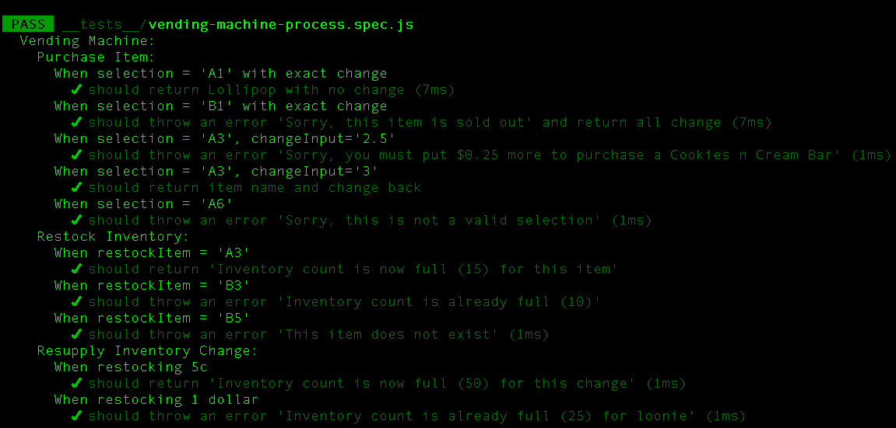

# Vending Machine

## Information

This project includes a reusable vending machine, that dispenses and restocks items, and resupplies coin inventory without a Javascript interface.

## Screenshots



## Technologies and/or Libraries Used

- Jest
- Javascript

## Set-up Instructions

Clone repository and follow commands below:

### Installation

```bash
npm install
```

### Run Jest

```bash
npm run test
```

## Personal Learning and Challenges

This project is centered around

- TDD (Test Driven Development)
- BDD (Behavior Driven Development)

## Authors

- Sydney Douglas (https://github.com/sydneydou)
